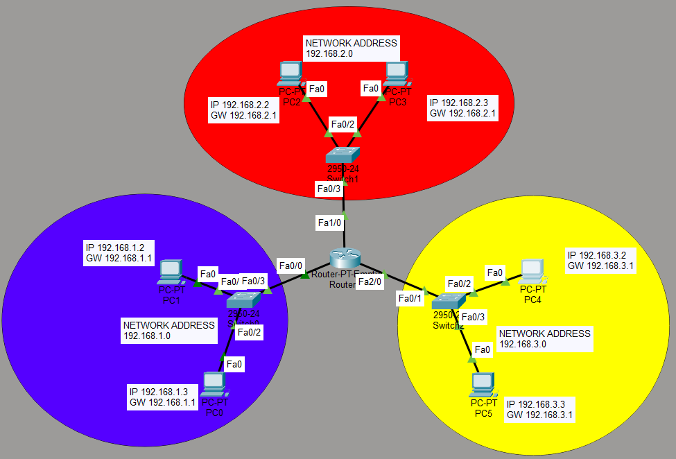

## Basic Router Configuration

### Overview

This lab demonstrates how to configure a single router interconnecting three separate LAN segments. Each segment operates on a distinct network address and communicates with the others through the router acting as a Layer 3 gateway.

### Network Topology



### IP Address Table

|Device|Interface|IP Address|Subnet Mask|Default Gateway|
|-|-|-|-|-|
|Router0|Fa0/0|192.168.1.1|255.255.255.0|—|
|PC0|Fa0|192.168.1.3|255.255.255.0|192.168.1.1|
|PC1|Fa0|192.168.1.2|255.255.255.0|192.168.1.1|
|Router0|Fa1/0|192.168.2.1|255.255.255.0|—|
|PC2|Fa0|192.168.2.2|255.255.255.0|192.168.2.1|
|PC3|Fa0|192.168.2.3|255.255.255.0|192.168.2.1|
|Router0|Fa2/0|192.168.3.1|255.255.255.0|—|
|PC4|Fa0|192.168.3.2|255.255.255.0|192.168.3.1|
|PC5|Fa0|192.168.3.3|255.255.255.0|192.168.3.1|

### Router Configuration (Cisco IOS)

#### Initial Setup

```
Router> enable
Router# configure terminal
Router(config)# hostname Router
Router(config)# enable secret cisco123
Router(config)# banner motd # Authorized Access Only #
```

#### Interface Configuration

```
! Interface Fa0/0 — Network 192.168.1.0/24
Router(config)# interface FastEthernet0/0
Router(config-if)# ip address 192.168.1.1 255.255.255.0
Router(config-if)# no shutdown
Router(config-if)# exit

! Interface Fa1/0 — Network 192.168.2.0/24
Router(config)# interface FastEthernet1/0
Router(config-if)# ip address 192.168.2.1 255.255.255.0
Router(config-if)# no shutdown
Router(config-if)# exit

! Interface Fa2/0 — Network 192.168.3.0/24
Router(config)# interface FastEthernet2/0
Router(config-if)# ip address 192.168.3.1 255.255.255.0
Router(config-if)# no shutdown
Router(config-if)# exit
```

#### Saving Configuration

```
Router# write memory
! or alternatively:
Router# copy running-config startup-config
```

### Verification Commands

```
! Verify all interfaces and their IP addresses
Router# show ip interface brief

Interface         IP-Address      OK? Method Status   Protocol
FastEthernet0/0   192.168.1.1     YES manual up       up
FastEthernet1/0   192.168.2.1     YES manual up       up
FastEthernet2/0   192.168.3.1     YES manual up       up

! Test connectivity from router to each network
Router# ping 192.168.1.1
Router# ping 192.168.2.1
Router# ping 192.168.3.1

! Test end-to-end connectivity (from PC, via Command Prompt)
C:\\> ping 192.168.2.2   ! From PC in network 1 to PC in network 2
C:\\> ping 192.168.3.3   ! From PC in network 1 to PC in network 3
```


### Key Concepts

* **`no shutdown`** — Cisco router interfaces are administratively down by default. This command activates the interface.
* **Default Gateway** — Each end device must point its gateway to the router's IP on the same subnet. Without it, inter-network communication fails.
* **Connected Routes** — Once an interface is configured and active, Cisco IOS automatically installs a connected (`C`) route for that subnet in the routing table.

