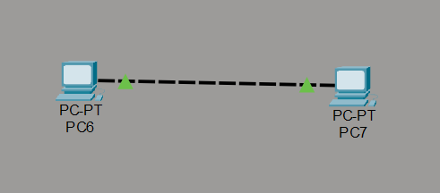
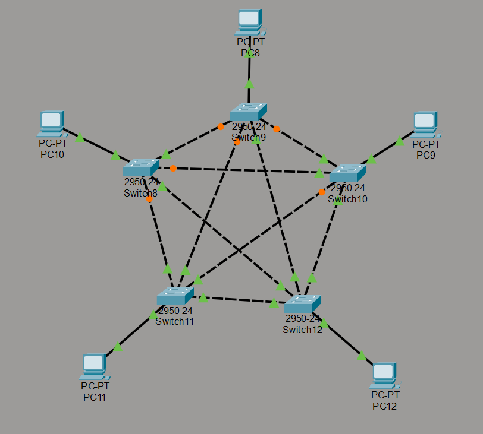
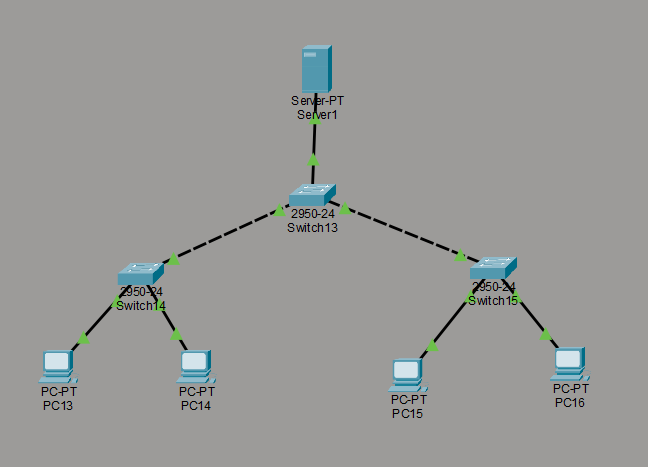
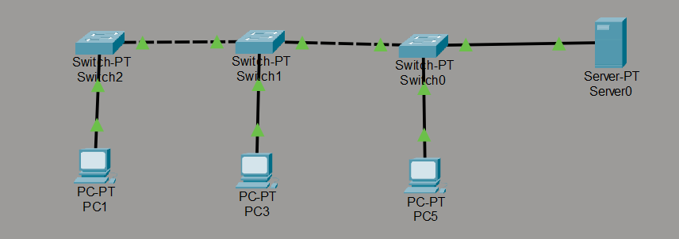
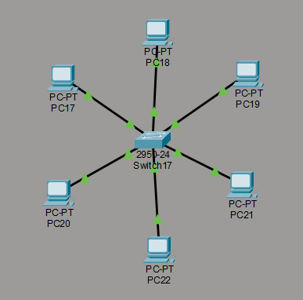
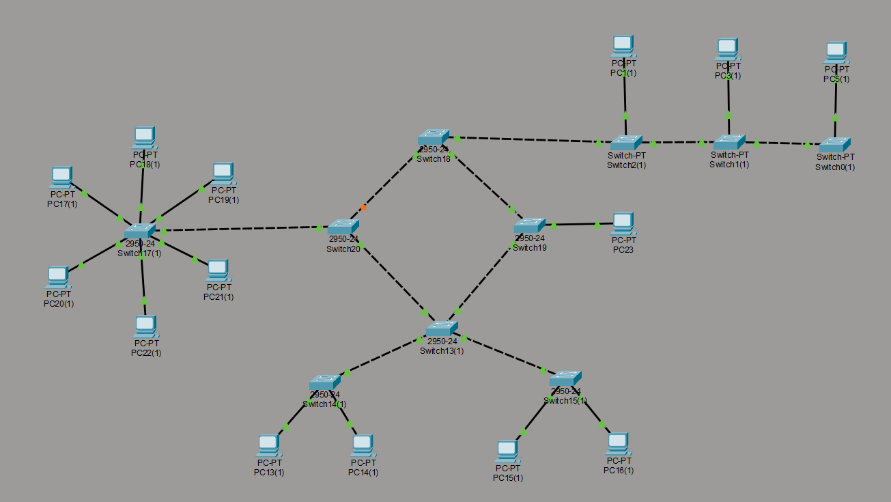
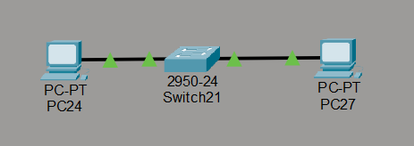
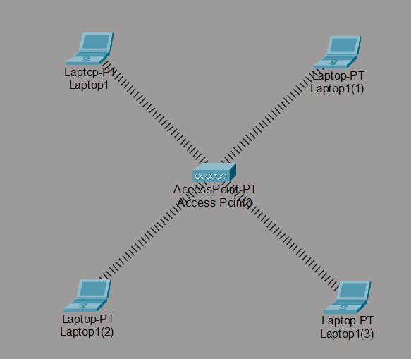
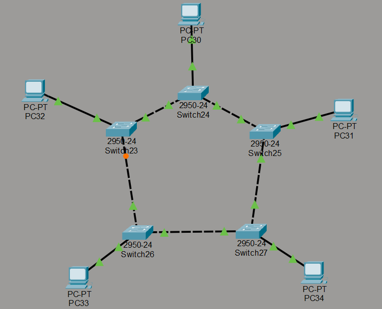

# Network Topologies

Network topology refers to the way devices in a computer network are arranged and connected to each other. It defines how data travels between devices and how the network is structured, both physically and logically.

Understanding network topology is important because it affects the performance, reliability, cost, and scalability of a network. Different topologies are suited for different environments, so choosing the right one is a key decision in network design.

---

## Table of Contents

- [Peer to Peer](#peer-to-peer)
- [Mesh](#mesh)
- [Tree](#tree)
- [Bus](#bus)
- [Star](#star)
- [Hybrid](#hybrid)
- [Linear](#linear)
- [WLAN](#wlan)
- [Ring](#ring)

---

## Peer to Peer

In a Peer to Peer (P2P) topology, each device connects directly to one or more other devices without a central server. Every device can act as both a client and a server, sharing resources directly with other devices on the network.

**Characteristics**

- No dedicated server is required
- Each device has equal status on the network
- Resources such as files and printers are shared directly between devices

**Advantages**

- Low cost to set up
- Simple to configure
- Does not depend on a single central device

**Disadvantages**

- Harder to manage as the number of devices grows
- Security is more difficult to enforce
- Performance can decrease when many devices are sharing resources

**Use Case**

A small home network where two or three computers share files and a printer directly with each other, without needing a server.

---

## Mesh

In a Mesh topology, every device is connected to every other device in the network. This creates multiple paths for data to travel, making the network highly reliable.

**Characteristics**

- Every node is connected to every other node (full mesh) or to several others (partial mesh)
- Data can be rerouted automatically if one connection fails
- Requires a large number of cables or wireless links

**Advantages**

- Very high fault tolerance
- No single point of failure
- Data can take the fastest available path

**Disadvantages**

- Expensive to install and maintain
- Complex to configure and manage
- The number of connections increases rapidly as devices are added

**Use Case**

Military communication systems and internet backbone infrastructure where continuous uptime and reliability are critical requirements.

---

## Tree

Tree topology organizes devices in a hierarchical structure, similar to branches on a tree. It is a combination of Star and Bus topologies, with a root node at the top and child nodes branching outward.

**Characteristics**

- Devices are arranged in a parent and child hierarchy
- A root switch or hub sits at the top of the structure
- Each branch can represent a department or a group of devices

**Advantages**

- Easy to expand by adding new branches
- Supports a large number of devices
- Faults in one branch do not affect others

**Disadvantages**

- If the root node fails, the entire network is affected
- Requires more cabling than simpler topologies
- More complex to manage than a flat network structure

**Use Case**

Large corporate networks where different departments, such as finance, sales, and operations, each have their own group of devices connected under a central network.

---

## Bus

In a Bus topology, all devices connect to a single central cable called the backbone or bus. Data sent by any device travels along this cable and is received by all other devices, but only the intended recipient processes it.

**Characteristics**

- All devices share one common communication line
- Data travels in both directions along the bus
- The ends of the cable are terminated to prevent signal reflection

**Advantages**

- Inexpensive and simple to install
- Uses less cable than most other topologies
- Easy to connect additional devices

**Disadvantages**

- If the backbone cable fails, the entire network goes down
- Performance decreases as more devices are added
- Difficult to identify and fix faults on the cable

**Use Case**

Small office networks with a limited number of devices, or temporary network setups where cost and simplicity are the main priorities.

---

## Star

In a Star topology, all devices connect to a single central device, usually a switch or hub. No device connects directly to another. All communication passes through the central device.

**Characteristics**

- One central switch or hub manages all connections
- Each device has its own dedicated cable to the center
- The central device controls data flow across the network

**Advantages**

- Easy to install and manage
- A fault in one cable or device does not affect the rest of the network
- Simple to add or remove devices

**Disadvantages**

- If the central switch or hub fails, all devices lose connectivity
- Requires more cabling than bus or linear topologies
- The capacity of the central device limits overall network performance

**Use Case**

The most common topology used in modern home and office networks. A home Wi-Fi router connected to multiple phones, laptops, and smart devices is a typical example.

---

## Hybrid

Hybrid topology is a combination of two or more different topologies working together as a single network. It is designed to take advantage of the strengths of each topology used.

**Characteristics**

- Mixes two or more topology types, such as Star and Mesh
- Different parts of the network can use different structures
- Designed to meet specific performance or reliability requirements

**Advantages**

- Highly flexible and customizable
- Can be scaled to meet growing needs
- Combines the benefits of multiple topologies

**Disadvantages**

- More complex to design and implement
- Higher cost due to varied hardware requirements
- Requires skilled administrators to manage and troubleshoot

**Use Case**

Large organizations such as universities or hospitals that have different networking needs across departments and buildings. One section may use Star topology while another uses Mesh for critical systems.

---

## Linear

Linear topology, also known as Daisy Chain topology, connects devices in a straight line. Each device connects to the next one in sequence, forming a single continuous path from one end to the other.

**Characteristics**

- Devices are connected one after another in a line
- Data passes through each device until it reaches the destination
- No central hub or switch is needed

**Advantages**

- Very simple and inexpensive to set up
- Requires minimal cabling
- Easy to understand and implement for small setups

**Disadvantages**

- If any single device or connection in the chain fails, the entire network is disrupted
- Performance drops as more devices are added
- Not suitable for large or growing networks

**Use Case**

Connecting a series of machines on a factory production line, or linking audio and video equipment in a home entertainment system where each device passes the signal to the next.

---

## WLAN

A Wireless Local Area Network (WLAN) topology connects devices using wireless radio signals instead of physical cables. Devices communicate through an Access Point (AP) or directly with each other in a wireless environment.

**Characteristics**

- Uses Wi-Fi or other wireless standards to connect devices
- Devices connect through a central Access Point in infrastructure mode
- Devices can also connect directly to each other in ad-hoc mode

**Advantages**

- No cables required, allowing freedom of movement
- Easy to add new devices to the network
- Cost-effective in environments where cabling is difficult

**Disadvantages**

- Wireless signals can be intercepted if not properly secured
- Signal quality can be affected by walls, distance, and interference
- Generally slower and less reliable than wired connections

**Use Case**

Coffee shops, airports, libraries, and office buildings that provide wireless internet access to users with laptops, smartphones, and tablets.

---

## Ring

In a Ring topology, each device connects to exactly two other devices, forming a closed circular loop. Data travels around the ring in one direction until it reaches the intended recipient.

**Characteristics**

- Devices are connected in a continuous loop
- Data moves in one direction (or both directions in a dual ring)
- A token is passed around the ring to control which device can send data

**Advantages**

- Orderly data transmission with no collisions
- Equal access for all devices on the network
- Performs consistently under heavy network load

**Disadvantages**

- A failure in any one device or connection can disrupt the entire network
- Adding or removing devices temporarily interrupts the network
- Less common in modern networks and largely replaced by Star topology

**Use Case**

Token Ring networks in older corporate environments, and Fiber Distributed Data Interface (FDDI) networks used for high-speed data transmission in metropolitan area networks.

---

## Conclusion

There is no single topology that works best for every situation. The right choice depends on the size of the network, the available budget, the required reliability, and how much the network is expected to grow.

For small and simple networks, Bus, Linear, or Peer to Peer topologies offer low-cost and easy setup. For modern offices and homes, Star topology is the most practical and widely used option. For large organizations that need high reliability and room to grow, Tree, Mesh, or Hybrid topologies are more appropriate. WLAN is the right choice when wireless flexibility is a priority.

Understanding the strengths and limitations of each topology helps network designers make informed decisions that match the real-world needs of the environment they are working in.
